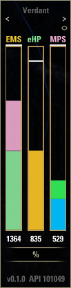
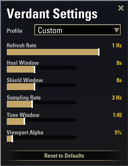
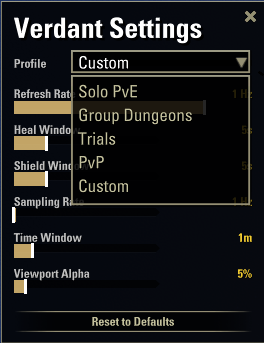
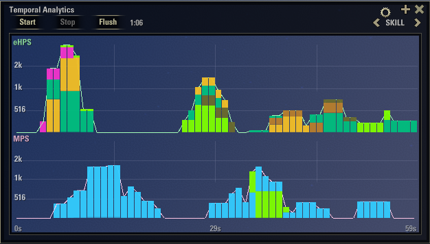
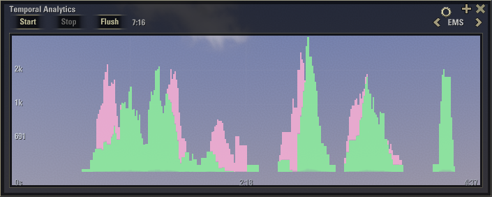
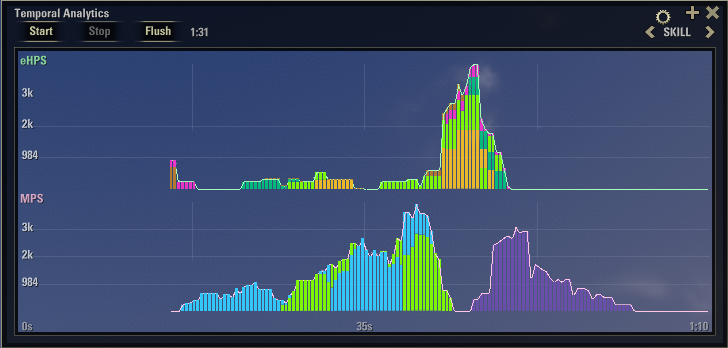

# Verdant


**Real-time healer contribution bar for The Elder Scrolls Online**

Verdant quantifies healing and shielding by adapting to your context. It tracks contribution: how much of the effective healing ceiling your output actually fills.

---

## Contents

- [Core Metrics](#core-metrics) — what eHPS, MPS and EMS mean
- [The Contribution Bar](#the-contribution-bar) — how the bar reads in solo vs group play
- [Display Modes](#display-modes) — bar layouts and skill-color segmentation
- [Settings](#settings) — profiles and individual sliders
- [Temporal Analytics](#temporal-analytics-graph-window) — the graph window
- [Installation](#installation)
- [Known Limitations](#known-limitations)

---

## Core Metrics

### Effective Healing Per Second


Healing that lands on missing HP

### Mitigation Per Second


Damage absorbed by shields you cast

### Effective Mitigation Score


The combined metric. This is what the bar primarily represents.

$$EMS = eHPS + MPS$$

---

## The Contribution Bar

**Open world** — the bar measures *efficiency*: what fraction of everything you cast was actually useful.

**In a group** — the bar measures *coverage*: how well your output keeps pace with the damage your group is taking. 

> Verdant switches between both modes automatically based on group status.

### Bar fill

The **EMS** bar uses two stacked fills:

- **Green (bottom)** — your **eHPS** share of **EMS**
- **Pink (above)** — your **MPS** share of **EMS**

This lets you see whether your contribution is heal-driven, shield-driven, or a mix!

---

## Display Modes

Cycle through modes with the **<** / **>** arrows at the top of the window.

| Mode | What it shows |
|------|---------------|
| **EMS** | Single bar: green (**eHPS**) + pink (**MPS**) stacked fills |
| **eHPS** | Segmented bar, each segment colored by the **ability's class** or **skill line** |
| **MPS** | Segmented bar, each segment colored by the** ability's class** or **skill line** |
| **ALL** | Three columns side by side — **EMS**, *eHPS* and **MPS** simultaneously |

The **%** / **#** button below, are not the best, but toggles between contribution percentage and raw value

### Skill-color segmentation

In **eHPS** and **MPS** modes the bar is split into colored segments — one per ability group — so you can see which **class** or **skill line** is carrying the most weight.

<details>
<summary>Color reference (16 groups)</summary>

| Swatch | Group |
|--------|-------|
|  | Arcanist |
|  | Dragonknight |
|  | Necromancer |
|  | Nightblade |
|  | Sorcerer |
|  | Templar |
|  | Warden |
|  | Restoration Staff |
|  | Destruction Staff |
|  | Mages Guild |
|  | Undaunted |
|  | Vampire |
|  | Scribing |
|  | Alliance War support |
|  | Item sets |
|  | Unclassified |

</details>

### In-Game example



---

## Settings

Click the **gear icon**  to open the settings panel
All values are saved per account.

The panel has two layers of control: 
  - **Profiles** at the top apply ready-made tunings for common play styles
  - **individual sliders** below let you fine-tune each one manually. 
  - **Reset to Defaults** button at the bottom restores a known-good baseline in one click.





### Profiles

**Don't want to fiddle with sliders?** Pick a profile that matches what you're playing.

Tweaking any slider afterwards switches the profile to **Custom** so your manual changes aren't lost.

<details>
<summary>Profile values</summary>

| Profile | Refresh | Heal Window | Shield Window | Sampling | Time Window |
|---------|---------|-------------|---------------|----------|-------------|
| **Solo PvE** *(default)* | 1 Hz | 5 s | 10 s | 1 Hz | 1 min |
| **Group Dungeons** | 2 Hz | 5 s | 7 s | 1 Hz | 3 min |
| **Trials** | 1 Hz | 5 s | 7 s | 1 Hz | 10 min |
| **PvP** | 5 Hz | 3 s | 5 s | 5 Hz | 30 s |
| **Custom** | *(your tweaks)* | | | | |

</details>




> **Viewport Alpha** is intentionally outside profiles, it's purely cosmetic, so changing profile won't lose your transparency preference.

<details>
<summary><strong>Individual sliders</strong> — for the curious or the tinkerers</summary>

#### Refresh Rate

How often the **bar window** redraws.

Six presets from `0.5 Hz` to `20 Hz`. Default **1 Hz**.

| Preset | Interval |
|--------|----------|
| 20 Hz | 50 ms |
| 10 Hz | 100 ms |
| 5 Hz | 200 ms |
| 2 Hz | 500 ms |
| 1 Hz | 1000 ms (default) |
| 0.5 Hz | 2000 ms |

#### Heal Window

The rolling time window used to calculate **eHPS**. A shorter window reacts faster; a longer one smooths out burst heals.

Range: **1 s → 30 s**, in 1 s steps. Default **5 s**.

#### Shield Window

The rolling time window used to calculate **MPS**. Shields are sparse events, so a wider window is sometimes convenient to avoid the metric collapsing to zero between hits.

Range: **1 s → 30 s**, in 1 s steps. Default **10 s**.

#### Sampling Rate

How often the **temporal buffer** captures a snapshot for the graph window.

Range: **1 Hz → 10 Hz**, in 1 Hz steps. Default **1 Hz**.

#### Time Window

How far back the graph window remembers samples (= buffer capacity).

Range: **15 s → 10 min**, in 15 s steps. Default **1 min**.

> Combinations that produce a heavy buffer (`time_window_s × sample_hz > 1500 samples`) trigger an in-chat warning. High sampling × long window can impact FPS — favor lower sample rates for long windows.

</details>

### Viewport Alpha

Transparency of the **graph window's inner viewport**. Useful when you want to see the world behind the chart.

Range: **0% → 100%**, in 5% steps. Default **30%**.

### Reset to Defaults

A button at the bottom of the panel restores every slider to the Solo PvE profile values plus the default viewport alpha, persisted and reapplied in one click.

---

## Temporal Analytics (Graph Window)

Click the **graph icon** (**+**) (next to the gear icon) on the bar to open the dedicated graph window. 
The graph window is independently movable and resizable.



**Controls**:

| Button | Action |
|---|---|
| **Start** | Begin recording samples into the temporal buffer |
| **Stop**  | Stop recording (the existing samples remain visible) |
| **Flush** | Stop recording and clear the buffer |
| **<** view **>** | Navigate between the two views |

**Views**:

- **EMS** — stacked fill of eHPS (green) and MPS (pink) per sample.




- **SKILL** — two sub-plots, eHPS on top and MPS below, each showing colored stacked fills broken down by class / skill-line.





---

## Installation

1. Download the latest release.
2. Extract to your AddOns folder:
   ```
   Documents/Elder Scrolls Online/live/AddOns/Verdant/
   ```
3. Reload the UI with `/reloadui` or restart the game.
4. The bar appears by default. Drag it anywhere on screen.

A keybinding to toggle the bar can be assigned under **Controls → Verdant**.


---

## Known Limitations

- **PvP** (Battlegrounds, Cyrodiil) is not yet validated — group damage tracking may not correctly reflect PvP hit events.
- Shields cast by **other players** are not tracked; only your own.
- **Ability classification** is name-pattern based. Newly added abilities may appear grey until the pattern list is updated.

---

*Verdant v1.1.0 — API 101049*
