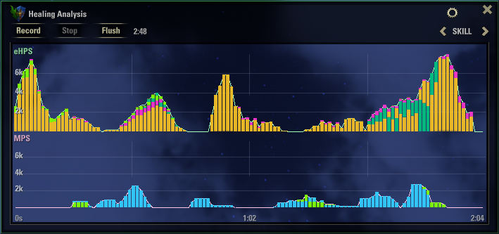
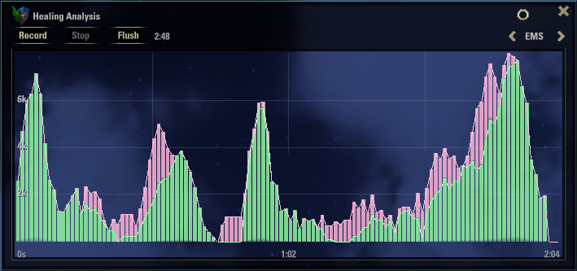
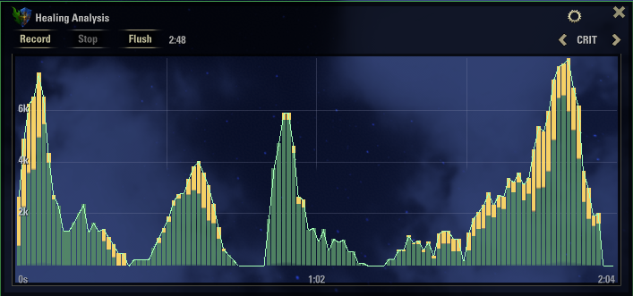

# Verdant


> *[Vermilion](https://github.com/vergelli/Vermilion)'s good brother.*


**Real-time healer contribution bar for The Elder Scrolls Online**

*How much of the healing and shielding that needed to happen did you actually deliver?* It tracks **contribution** — your share of the effective healing ceiling — and adapts what it measures to whether you're playing solo or in a group.

---

## Contents

- [Philosophy](#philosophy) — what Verdant is and isn't
- [Installation](#installation)
- [The Graph Window](#the-graph-window) — recording, the three views
- [Skill Colors & Unknown Contributions](#skill-colors--unknown-contributions)
- [Settings](#settings) — profiles and sliders
- [Usage](#usage) — commands and keybinds
- [Core Metrics](#core-metrics) — eHPS, MPS, EMS, and the contribution bar
- [Known Limitations](#known-limitations)
- [License](#license)

---

## Philosophy

- **Live, not a post-fight report.** A moving trend you read while you play — never a log you open afterward.
- **No dependencies.** No libraries, no companion add-ons. One folder, drop it in, done.

---

## Installation

1. Download the latest release from [ESOUI](https://www.esoui.com/downloads/info4557-Verdant.html) or [GitHub](https://github.com/vergelli/verdant).
2. Extract into your AddOns folder:
   ```
   Documents/Elder Scrolls Online/live/AddOns/Verdant/
   ```
3. Reload with `/reloadui` or restart the game.
4. The bar appears by default — drag it anywhere on screen. It's optional: turn it off (or back on) any time under **Settings → Individual Bars**. When it's on, a **+** on it opens the graph.

A keybinding to show / hide Verdant can be assigned under **Controls → Verdant**.

> Verdant stores settings and data **per server** — your EU, NA and PTS profiles stay separate.

---

## The Graph Window




**Controls:**

| Button | Action |
|---|---|
| **Start** | Begin recording samples into the temporal buffer |
| **Stop** | Stop recording (existing samples stay visible) |
| **Flush** | Stop recording and clear the buffer |
| **‹** view **›** | Cycle between the three views |

### Views


**SKILL** — two sub-plots, eHPS on top and MPS below, each broken into colored segments by **class** or **skill line**. See which part of your kit is carrying the healing.


**EMS** — a stacked fill of your eHPS  and MPS  per sample, so you can read the shape of your output over time.



**CRIT** — your eHPS split into its non-critical base  and its critical cap . Read your crit-heal ratio at a glance, and watch how it tracks across a fight.



---

## Skill Colors & Unknown Contributions

In the **SKILL** view (and the bar's per-skill modes), every segment is colored by the **class** or **skill line** the ability belongs to, so you can see at a glance which source is doing the work.

<details>
<summary>Color reference (18 groups)</summary>

| Swatch | Group |
|--------|-------|
|  | Arcanist |
|  | Dragonknight |
|  | Necromancer |
|  | Nightblade |
|  | Sorcerer |
|  | Templar |
|  | Warden |
|  | Restoration Staff |
|  | Destruction Staff |
|  | Mages Guild |
|  | Undaunted |
|  | Vampire |
|  | Werewolf |
|  | Scribing |
|  | Psijic Order |
|  | Alliance War support |
|  | Item sets |
|  | Unclassified (grey) |

</details>

A few hits — usually item-set procs or enchants with generic icons — can't be matched to a skill line and show up **grey**. To color them yourself: open **Settings → Unknown Contributions**, pick a category for each, and it applies live (no reload). ESO exposes no ability-to-set mapping, so this lets you label the handful Verdant can't.

---

## Settings

Click the **gear icon**  to open the settings panel. All values are saved per account.


The panel has two layers:

- **Profiles** at the top apply ready-made tunings for common play styles.
- **Individual sliders** below let you fine-tune each one by hand.
- **Reset to Defaults** restores a known-good baseline in one click.

### Profiles

Don't want to fiddle with sliders? Pick a profile that matches what you're playing. Tweaking any slider afterward switches the profile to **Custom**, so your manual changes aren't lost.

<details>
<summary>Profile values</summary>

| Profile | Refresh | Heal Window | Shield Window | Sampling | Time Window |
|---------|---------|-------------|---------------|----------|-------------|
| **Solo PvE** *(default)* | 1 Hz | 5 s | 10 s | 1 Hz | 1 min |
| **Group Dungeons** | 2 Hz | 5 s | 7 s | 1 Hz | 3 min |
| **Trials** | 1 Hz | 5 s | 7 s | 1 Hz | 10 min |
| **PvP** | 5 Hz | 3 s | 5 s | 5 Hz | 30 s |
| **Custom** | *(your tweaks)* | | | | |

</details>


<details>
<summary><strong>Individual sliders</strong> — for the curious and the tinkerers</summary>

#### Refresh Rate
How often the **bar window** redraws. Six presets from `0.5 Hz` to `20 Hz`. Default **1 Hz**.

#### Heal Window
The rolling window used to calculate **eHPS**. A shorter window reacts faster; a longer one smooths out burst heals. Range **1 s → 30 s**, 1 s steps. Default **5 s**.

#### Shield Window
The rolling window used to calculate **MPS**. Shields are sparse events, so a wider window avoids the metric collapsing to zero between hits. Range **1 s → 30 s**, 1 s steps. Default **10 s**.

#### Sampling Rate
How often the **graph** captures a snapshot. Range **1 Hz → 10 Hz**, 1 Hz steps. Default **1 Hz**.

#### Time Window
How far back the graph remembers samples (= buffer capacity). Range **15 s → 10 min**, 15 s steps. Default **1 min**.

> A long window combined with a high sample rate produces a heavy buffer (`time_window_s × sample_hz`). Past ~1500 samples Verdant shows an in-chat warning — the chart has to draw every sample each frame, so very high combinations can cost FPS. For now, favor lower sample rates for long windows — a future version will draw long buffers far more efficiently.

</details>

### Viewport Alpha

Transparency of the **graph window's inner viewport** — handy when you want to see the world behind the chart. Range **0% → 100%**, 5% steps. Default **30%**. Kept outside profiles, since it's purely cosmetic.

---

## Usage

| Action | How |
|---|---|
| Show / hide Verdant | Keybind under **Controls → Verdant** |
| Open the graph | The **+** icon on the bar, or `/verdant graph` |
| Turn the bar on / off | **Settings → Individual Bars** |
| Switch views | The **‹** / **›** arrows in the window title |
| Record a session | **Start**, then **Stop** / **Flush** |
| Open settings | The **⚙** gear icon |
| Color a grey ability | **Settings → Unknown Contributions** |


---

## Core Metrics

The heart of Verdant. Three numbers describe your healing, and one of them drives the bar.

### Effective Healing Per Second (eHPS)


Healing that lands on missing HP — overhealing is excluded.

### Mitigation Per Second (MPS)


Damage absorbed by shields you cast.

### Effective Mitigation Score (EMS)


The combined metric, and what the bar primarily represents:

$$EMS = eHPS + MPS$$

### The Contribution Bar

Verdant reads your contribution differently depending on context, switching automatically based on group status:

- **Open world** — the bar measures *efficiency*: what fraction of everything you cast was actually useful.
- **In a group** — the bar measures *coverage*: how well your output keeps pace with the damage your group is taking.

**Bar fill.** The **EMS** bar uses two stacked fills:

-  **eHPS** (bottom) — your share of EMS
-  **MPS** (above) — your share of EMS

So you can see at a glance whether your contribution is heal-driven, shield-driven, or a mix.

<details>
<summary><strong>Bar display modes</strong> — cycle with the ‹ / › arrows</summary>

| Mode | What it shows |
|------|---------------|
| **EMS** | Single bar: green (eHPS) + pink (MPS) stacked fills |
| **eHPS** | Segmented bar, each segment colored by the ability's class or skill line |
| **MPS** | Segmented bar, each segment colored by the ability's class or skill line |
| **ALL** | Three columns side by side — EMS, eHPS and MPS at once |

The **%** / **#** button toggles between contribution percentage and raw value.

</details>


