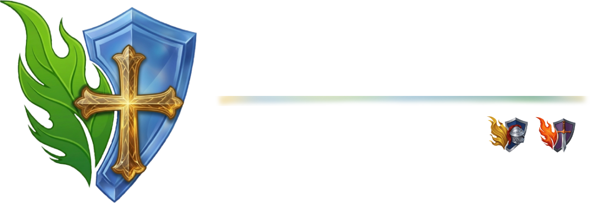
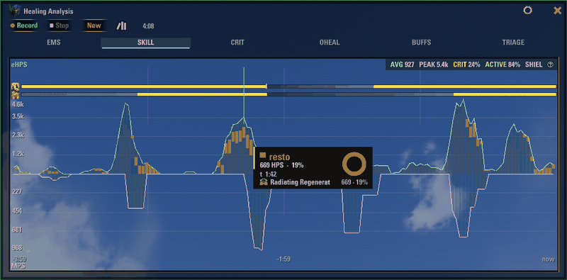
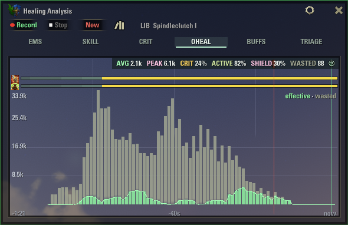
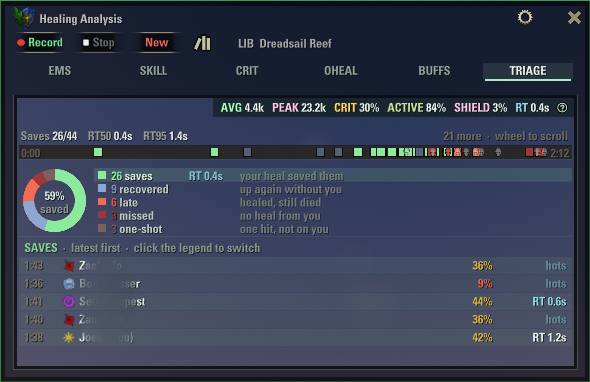
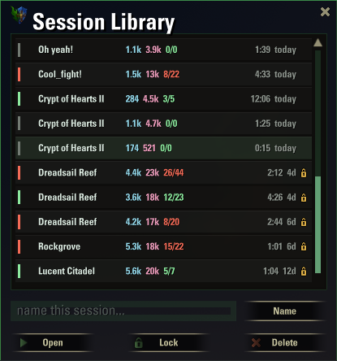
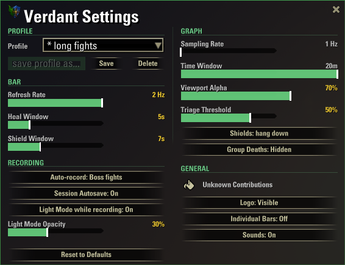

# Verdant

A healing tracker for The Elder Scrolls Online. It records what your heals and shields actually did during a fight, then shows you where it landed, where it was wasted, and who you kept alive.

The green twin of [Vermilion](https://github.com/vergelli/Vermilion).

- [Install](#install)
- [The graph](#the-graph)
- [The report](#the-report)
- [Session library](#session-library)
- [Settings](#settings)
- [Commands and keys](#commands-and-keys)
- [What the numbers mean](#what-the-numbers-mean)
- [License](#license)

## Install

Download from [ESOUI](https://www.esoui.com/downloads/info4557-Verdant.html) or from the [releases page](https://github.com/vergelli/verdant/releases), extract into `Documents/Elder Scrolls Online/live/AddOns/`, then `/reloadui`.

A small bar appears. Drag it where you like. The **+** on it opens the graph window. Settings and data are kept per server, so EU, NA and PTS stay separate.

## The graph

Press **Record** before a fight, **Stop** after it. **New** clears the plot for the next one. There is also a keybind for start and stop under Controls, and an auto-record option for boss fights.

Six views share one window. Click a tab, or click the view name to move to the next one.

**SKILL** splits your healing by class or skill line. Hover a bar to see which abilities were doing the work at that moment. Shields hang below the axis.

**OHEAL** stacks effective healing under the overflow. If the grey towers over the green, that healing went to full health bars.

**TRIAGE** is about people, not numbers. Every time an ally dropped low, Verdant records what happened next: saved by you, recovered on their own, healed too late, missed, or one-shot. Click a class in the legend to list its episodes.

**EMS** shows healing and mitigation together over time. **CRIT** separates the critical part of your healing. **BUFFS** shows the uptime of the buffs you keep on the group, and lets you star one to get a countdown before it drops.

The rows above the plot are your ultimates: one per bar, charging against its own cost, gold when ready, a white tick at each cast.

## The report

After Stop, the chip in the top corner sums up the recording: average, peak, crit rate, active time, shield share, wasted healing and reaction time. Hover it for the full report, click it to copy the text into chat.

## Session library

Every recording is saved. Open the library from the graph window to reopen a night, name it, lock it so it never rotates out, or delete it. Double-click a row to open it, or use the arrow keys and Enter.

## Settings

The gear icon opens the settings. Pick a profile that matches what you play and forget the sliders. Touching a slider switches the profile to Custom, and you can save your own under a name.

| Profile | Bar refresh | Heal window | Shield window | Sampling | Time window |
|---|---|---|---|---|---|
| Solo PvE (default) | 1 Hz | 5 s | 10 s | 1 Hz | 1 min |
| Group Dungeons | 2 Hz | 5 s | 7 s | 1 Hz | 3 min |
| Trials | 1 Hz | 5 s | 7 s | 1 Hz | 10 min |
| PvP | 5 Hz | 3 s | 5 s | 5 Hz | 30 s |

The graph does not need a high sampling rate. If you combine a fast rate with a long window the sliders turn red and Verdant asks you to confirm. One sample per second and a window of one to ten minutes covers everything.

## Commands and keys

| What | How |
|---|---|
| Show or hide the bar | `/verdant`, or the keybind under Controls |
| Open the graph | `/verdant graph`, the **+** on the bar, or its keybind |
| Start or stop recording | The buttons, or the keybind |
| Open the session library | `/verdant lib`, or the book icon in the graph |
| Close settings or the library | Its **x**, or Escape |
| Colour a grey ability | Settings, Unknown Contributions |
| List all commands | `/verdant help` |

## What the numbers mean

- **eHPS** is healing that landed on missing health. Overhealing does not count.
- **MPS** is damage absorbed by shields you cast.
- **EMS** is the two added together. It is what the bar shows.
- **Wasted** is the healing that reached a full health bar. Heals over time doing that is normal. Direct heals doing it is the part you can work on.
- **RT** is your reaction time: how long an ally stayed low before your heal reached them.

Verdant does nothing with damage you deal. That is what Vermilion is for.

## License

MIT. Source on [GitHub](https://github.com/vergelli/verdant). Forks and pull requests are welcome.
