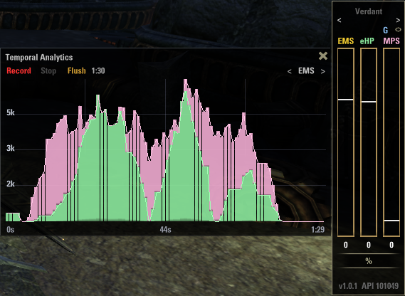

# Verdant


**Real-time healer contribution bar for The Elder Scrolls Online**

Verdant quantifies your healing and shielding output into a single bar that adapts its meaning depending on whether you are playing solo or in a group. 
In other words it tracks *contribution*: how much of a meaningful ceiling your output is covering.

---

## Core Metrics

### Effective Healing Per Second


Healing that lands on missing HP

### Mitigation Per Second


Damage absorbed by shields you cast

### Effective Mitigation Score



The combined metric. This is what the bar primarily represents.

$$EMS = eHPS + MPS$$

---

## The Contribution Bar

**Open world** — the bar measures *efficiency*: what fraction of everything you cast was actually useful.

**In a group** — the bar measures *coverage*: how well your output keeps pace with the damage your group is taking. 

> Verdant switches between both modes automatically based on group status.

> PvP Environments (BG specially) are Work in Progress

### Bar fill

The **EMS** bar uses two stacked fills:

- **Green (bottom)** — your **eHPS** share of **EMS**
- **Pink (above)** — your **MPS** share of **EMS**

This lets you see at a glance whether your contribution is heal-driven, shield-driven, or a mix!

---

## Display Modes

Cycle through modes with the **<** / **>** arrows at the top of the window.

| Mode | What it shows |
|------|---------------|
| **EMS** | Single bar: green (**eHPS**) + pink (**MPS**) stacked fills |
| **eHPS** | Segmented bar, each segment colored by the **ability's class** or **skill line** |
| **MPS** | Segmented bar, each segment colored by the** ability's class** or **skill line** |
| **ALL** | Three columns side by side — **EMS**, *eHPS* and **MPS** simultaneously |

The **%** / **#** button below, are not the best, but toggles between contribution percentage and raw value

### Skill-color segmentation

In **eHPS** and **MPS** modes the bar is split into colored segments — one per ability group — so you can see which **class** or **skill line** is carrying the most weight.

| Swatch | Group |
|--------|-------|
|  | Templar |
|  | Arcanist |
|  | Warden |
|  | Restoration Staff |
|  | Dragonknight |
|  | Sorcerer |
|  | Nightblade |
|  | Necromancer |
|  | Scribing |
|  | Undaunted |
|  | Alliance War support |
|  | Unclassified |

### In-Game example


---

## Settings

Click the **gear icon** (top-right corner of the value row) to open the settings panel. 

All values are saved per account.

### Refresh Rate

How often the bar redraws **(watch performance)**

Six presets from `0.5 Hz` to `20 Hz`. Default is `1 Hz`.

| Preset | Interval |
|--------|----------|
| 20 Hz | 50 ms |
| 10 Hz | 100 ms |
| 5 Hz | 200 ms |
| 2 Hz | 500 ms |
| 1 Hz | 1000 ms (default) |
| 0.5 Hz | 2000 ms |

### Heal Window

The rolling time window used to calculate **eHPS**. A shorter window reacts faster; a longer one smooths out burst heals.

| Preset |
|--------|
| 2 s |
| 3 s |
| **5 s** (default) |
| 8 s |
| 10 s |
| 15 s |

### Shield Window

The rolling time window used to calculate **MPS**. Shields are sparse events, so a wider window sometimes is convenient to avoid the metric collapsing to zero between hits (not an often thing anyway)

| Preset |
|--------|
| 10 s |
| 15 s |
| **30 s** (default) |
| 45 s |
| 60 s |

---

## Installation

1. Download the latest release from [ESOUI](https://www.esoui.com) or [GitHub Releases](../../releases).
2. Extract to your AddOns folder:
   ```
   Documents/Elder Scrolls Online/live/AddOns/Verdant/
   ```
3. Reload the UI with `/reloadui` or restart the game.
4. The bar appears by default. Drag it anywhere on screen.

A keybinding to toggle the bar can be assigned under **Controls → Verdant**.

---

## Known Limitations

- **PvP** (Battlegrounds, Cyrodiil) is not yet validated — group damage tracking may not correctly reflect PvP hit events.
- Shields cast by **other players** are not tracked; only your own.
- **Ability classification** is name-pattern based. Newly added abilities may appear grey until the pattern list is updated.

---

*Verdant v1.0.0 — API 101049*
